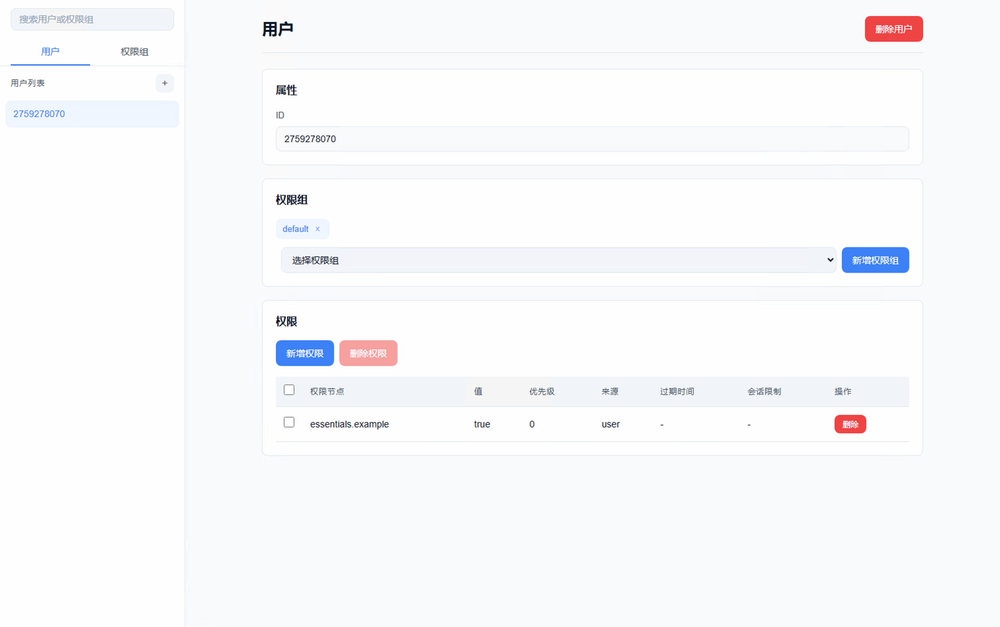

# astrbot_plugin_essentials


[](https://app.codacy.com/gh/CPJiNan/astrbot_plugin_essentials/dashboard?utm_source=gh&utm_medium=referral&utm_content=&utm_campaign=Badge_grade)
[](https://www.codefactor.io/repository/github/CPJiNan/astrbot_plugin_essentials)

[](https://deepwiki.com/CPJiNan/astrbot_plugin_essentials)


一款集成权限、经济、安全、管理功能的 AstrBot 基础插件。

## 权限模块（permission）

Essentials 提供了强大的权限管理系统，支持灵活的权限配置和继承机制，同时配有可视化的 Web 管理界面。

### 图片展示



### 命令列表

| 命令                                                 | 描述         |
|----------------------------------------------------|------------|
| /permission user info <用户ID>                       | 获取用户信息     |
| /permission user permission has <用户ID> <权限>        | 检查用户权限     |
| /permission user permission add <用户ID> <权限>        | 新增用户权限     |
| /permission user permission remove <用户ID> <权限>     | 移除用户权限     |
| /permission user group add <用户ID> <权限组编辑名>         | 新增用户权限组    |
| /permission user group remove <用户ID> <权限组编辑名>      | 移除用户权限组    |
| /permission group list                             | 获取权限组列表    |
| /permission group info <权限组编辑名>                    | 获取权限组信息    |
| /permission group create <权限组编辑名>                  | 创建权限组      |
| /permission group delete <权限组编辑名>                  | 删除权限组      |
| /permission group permission add <权限组编辑名> <权限>     | 新增权限组权限    |
| /permission group permission remove <权限组编辑名> <权限>  | 移除权限组权限    |
| /permission group parent add <权限组编辑名> <父权限组编辑名>    | 为权限组新增父权限组 |
| /permission group parent remove <权限组编辑名> <父权限组编辑名> | 从权限组移除父权限组 |

### 占位符列表

| 占位符                                   | 描述      |
|---------------------------------------|---------|
| %permission_groups%                   | 获取权限组列表 |
| %permission_has_permission_<用户>_<权限>% | 检查用户权限  |
| %permission_in_group_<用户>_<权限组>%      | 检查用户权限组 |

### 调用示例

```python
from astrbot.api.event import filter, AstrMessageEvent
from astrbot.api.star import Context, Star


class Plugin(Star):
    def __init__(self, context: Context):
        super().__init__(context)
        self.permission_api = getattr(self.context, 'essentials_permission_api', None)

    @filter.command("示例命令")
    async def example(self, event: AstrMessageEvent):
        # 检查 Essentials 权限接口。
        if not self.permission_api:
            yield event.plain_result("获取权限接口失败，请检查前置插件 Essentials 是否启用。")
            return
        # 检查消息发送者是否拥有 AstrBot 管理员或 essentials.example 权限。
        if not event.is_admin() and not await self.permission_api.has_user_permission(event.get_sender_id(),
                                                                                      "essentials.example",
                                                                                      event.session_id):
            yield event.plain_result("无使用当前命令的权限。")
            return
        # 命令逻辑。
        yield event.plain_result("示例命令执行成功。")
```

## 占位符模块（placeholder）

Essentials 提供了灵活的占位符系统，支持在消息文本中使用变量，同时允许注册自定义占位符扩展。

### 命令列表

| 命令                      | 描述        |
|-------------------------|-----------|
| /placeholder parse <文本> | 解析文本中的占位符 |
| /placeholder list       | 获取占位符扩展列表 |
| /placeholder info <标识符> | 获取占位符扩展信息 |

### 调用示例

```python
import random

from astrbot.api.event import filter, AstrMessageEvent
from astrbot.api.star import Context, Star


class Plugin(Star):
    def __init__(self, context: Context):
        super().__init__(context)
        self.placeholder_api = getattr(self.context, 'essentials_placeholder_api', None)

    async def initialize(self):
        if self.placeholder_api:
            await self.placeholder_api.register(
                self.placeholder_api.create_expansion(
                    identifier="example",
                    author="Author",
                    version="1.0.0",
                    handler=self._on_placeholder_request
                )
            )

    async def _on_placeholder_request(self, params: str) -> str:
        # 占位符逻辑。
        match params:
            case "random":
                return str(random.randint(1, 100))
            case _:
                return ""

    async def terminate(self):
        if self.placeholder_api:
            await self.placeholder_api.unregister("example")
```

## 经济模块（economy）

Essentials 提供了便捷的经济系统，支持多种货币的创建和管理。

### 命令列表

| 命令                               | 描述     |
|----------------------------------|--------|
| /economy balance <用户ID> <货币>     | 获取用户余额 |
| /economy create <用户ID>           | 创建用户账户 |
| /economy delete <用户ID>           | 删除用户账户 |
| /economy set <用户ID> <货币> <数量>    | 设置用户余额 |
| /economy add <用户ID> <货币> <数量>    | 增加用户余额 |
| /economy remove <用户ID> <货币> <数量> | 减少用户余额 |

### 占位符列表

| 占位符                           | 描述         |
|-------------------------------|------------|
| %economy_balance_<用户ID>_<货币>% | 获取用户余额     |
| %economy_has_account_<用户ID>%  | 检查用户账户是否存在 |

### 调用示例

```python
from astrbot.api.event import filter, AstrMessageEvent
from astrbot.api.star import Context, Star


class Plugin(Star):
    def __init__(self, context: Context):
        super().__init__(context)
        self.economy_api = getattr(self.context, 'essentials_economy_api', None)

    @filter.command("示例命令")
    async def example(self, event: AstrMessageEvent):
        if not self.economy_api:
            yield event.plain_result("获取经济接口失败，请检查前置插件 Essentials 是否启用。")
            return
        user_id = event.get_sender_id()
        result = await self.economy_api.add_balance(user_id, "示例货币", 10)
        if result:
            balance = await self.economy_api.get_balance(user_id, "示例货币")
            yield event.plain_result(f"已为用户 {user_id} 增加 10 示例货币，当前余额：{balance}。")
```

## 相关链接

- **QQ 群**：[1103154674](https://qm.qq.com/q/N5J07bh5M4)