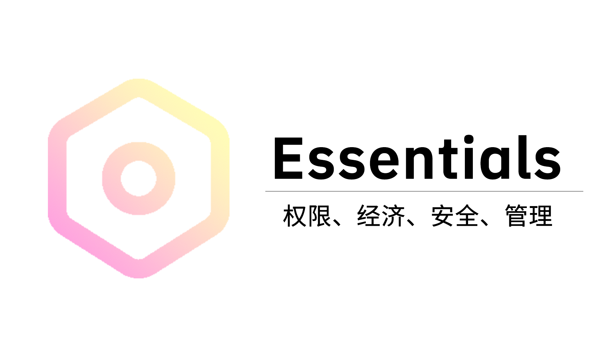

# astrbot_plugin_essentials



一款集成权限、经济、安全、管理功能的 AstrBot 基础插件。

## 权限模块（permission）

Essentials 提供了强大的权限管理系统，支持灵活的权限配置和继承机制，同时配有可视化的 Web 管理界面。

### 命令列表

| 命令                                                 | 描述         |
|----------------------------------------------------|------------|
| /permission user info <用户ID>                       | 获取用户信息     |
| /permission user permission has <用户ID> <权限>        | 检查用户权限     |
| /permission user permission add <用户ID> <权限>        | 新增用户权限     |
| /permission user permission remove <用户ID> <权限>     | 移除用户权限     |
| /permission user group add <用户ID> <权限组编辑名>         | 新增用户权限组    |
| /permission user group remove <用户ID> <权限组编辑名>      | 移除用户权限组    |
| /permission group list                             | 获取权限组列表    |
| /permission group info <权限组编辑名>                    | 获取权限组信息    |
| /permission group create <权限组编辑名>                  | 创建权限组      |
| /permission group delete <权限组编辑名>                  | 删除权限组      |
| /permission group permission add <权限组编辑名> <权限>     | 新增权限组权限    |
| /permission group permission remove <权限组编辑名> <权限>  | 移除权限组权限    |
| /permission group parent add <权限组编辑名> <父权限组编辑名>    | 为权限组新增父权限组 |
| /permission group parent remove <权限组编辑名> <父权限组编辑名> | 从权限组移除父权限组 |
| /permission editor start                           | 启动网页编辑器    |
| /permission editor stop                            | 关闭网页编辑器    |
| /permission editor status                          | 查看网页编辑器状态  |

### 调用示例

```python
from astrbot.api.event import filter, AstrMessageEvent
from astrbot.api.star import Context, Star


class Plugin(Star):
    def __init__(self, context: Context):
        super().__init__(context)
        self.context = context  # 传递插件接口上下文。

    @property
    def permission_api(self):
        """获取 Essentials 权限接口"""
        essentials = self.context.get_registered_star("astrbot_plugin_essentials")
        return getattr(essentials.star_cls, 'permission_api', None) if essentials else None

    @filter.command("示例命令")
    async def example(self, event: AstrMessageEvent):
        # 检查 Essentials 权限接口。
        if not self.permission_api:
            yield event.plain_result("获取权限接口失败，请检查前置插件 Essentials 是否启用。")
            return
        # 检查消息发送者是否拥有 AstrBot 管理员或 essentials.example 权限。
        if not event.is_admin() and not await self.permission_api.has_user_permission(event.get_sender_id(),
                                                                                      "essentials.example",
                                                                                      event.session_id):
            yield event.plain_result("无使用当前命令的权限。")
            return
        # 命令逻辑。
        yield event.plain_result("示例命令执行成功。")
```

## 相关链接

- **QQ 群**：[1103154674](https://qm.qq.com/q/N5J07bh5M4)